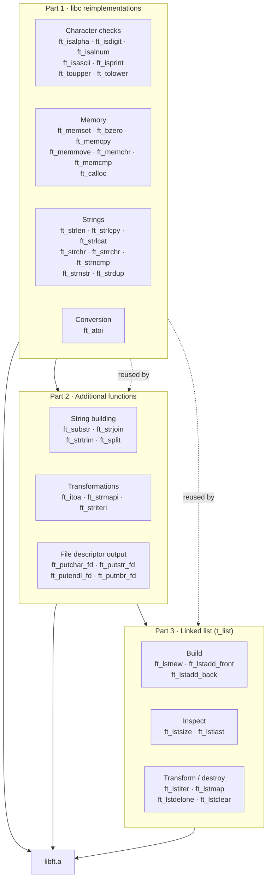
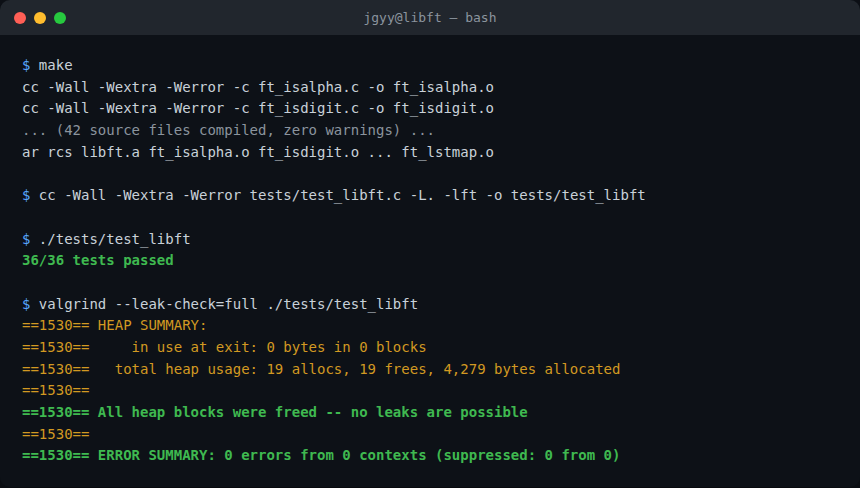

_This project has been created as part of the 42 curriculum by jgyy._

# libft

## Description

`libft` is a personal reimplementation of a subset of the C standard library,
built from scratch as the first project of the 42 core curriculum. Its goal
is to build strong foundations in C — memory management, string
manipulation, and data structures — by re-deriving well-known `libc`
behaviour, then extending it with a small toolkit of extra helpers (string
utilities, an integer-to-string converter, and a singly linked list API)
that are reused throughout the rest of the curriculum.

The library is delivered as a static archive, `libft.a`, built from 42
`ft_*.c` source files and a single public header, `libft.h`.

## Library overview



## Instructions

### Build

```sh
make        # builds libft.a
make re     # forces a full rebuild
make clean  # removes object files
make fclean # removes object files and libft.a
```

Every `.c` file compiles with `cc -Wall -Wextra -Werror`, and `libft.a` is
assembled with `ar rcs` at the root of the repository.

### Use in another project

```sh
# from your project's directory
cp -r path/to/libft libft
cd libft && make
cc your_program.c -Llibft -lft -Ilibft -o your_program
```

Include the header in your sources:

```c
#include "libft.h"
```

### Run the (non-graded) test suite

A small assertion-based test program lives in `tests/` and is not part of
the graded submission; it exists purely to sanity-check the implementation.

```sh
make
cc -Wall -Wextra -Werror tests/test_libft.c -L. -lft -o tests/test_libft
./tests/test_libft
```

Continuous Integration (`.github/workflows/ci.yml`) runs this same sequence,
plus a full rebuild via `make re` and a `valgrind --leak-check=full` pass,
on every push and pull request.



## Resources

- [`man` pages](https://man7.org/linux/man-pages/) for every reimplemented
  `libc` function (`man 3 <function>`), used as the normative reference for
  prototypes and edge-case behaviour.
- [POSIX.1-2017 Base Definitions](https://pubs.opengroup.org/onlinepubs/9699919799/)
  for `strlcpy`/`strlcat` and `strnstr` semantics on BSD-derived libc.
- [42 Norm](https://github.com/42School/norminette) documentation for the
  coding style enforced on this project.

**AI usage:** An AI coding assistant (Claude) was used to scaffold the
project's repository plumbing — the `Makefile`, the GitHub Actions CI
workflow, the non-graded test suite in `tests/`, this `README.md`, and the
architecture diagram above — and to produce norm-compliant implementations
of the required `ft_*` functions from their `man`-page specifications in
`libft.md`. Function behaviour was verified against the standard library
using the test suite and `valgrind`. No AI tool was used during any
peer-evaluation or exam setting.
